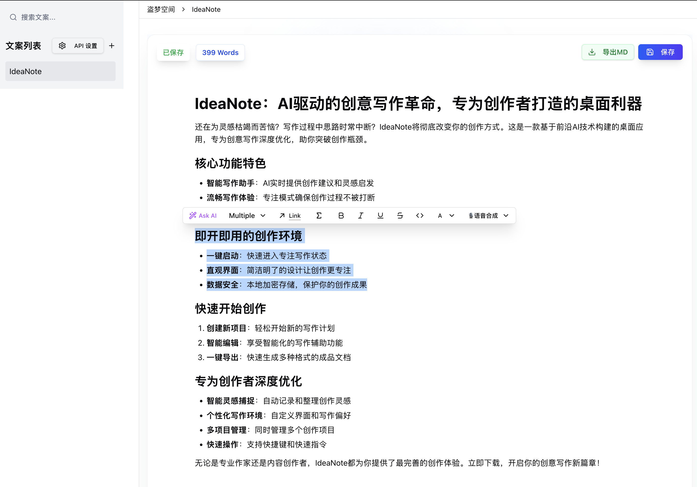

# IdeaNote - AI驱动的创意写作工具

<div align="center">

  
  
  **专为创意写作而设计的智能桌面应用**
  
  [](https://opensource.org/licenses/MIT)
  [](https://electronjs.org/)
  [](https://reactjs.org/)
  [](https://www.typescriptlang.org/)
</div>

## ✨ 项目简介

IdeaNote 是一款基于 Electron 的跨平台桌面应用，专为创意写作者打造。它集成了先进的 AI 技术，提供智能写作辅助、富文本编辑、文档管理等功能，让创意写作变得更加高效和有趣。

**作者**: ideaswork  
**联系方式**: ideaswork@qq.com  
**B站账号**: [@ideaswork](https://space.bilibili.com/28249524)

## 🚀 核心功能

### 📝 智能编辑器
- **Novel 编辑器**: 基于 Tiptap 的 Notion 风格 WYSIWYG 编辑器
- **AI 智能辅助**: 集成 DeepSeek AI，提供文稿润色、语法检查、内容扩写等功能
- **丰富的内容类型**: 支持文本、标题、列表、表格、代码块、数学公式等
- **实时预览**: 支持 Markdown 渲染和数学公式显示
- **快捷命令**: 通过 `/` 命令快速插入各种内容块

### 🤖 AI 写作助手
- **文稿润色**: 智能优化文本表达和语言风格
- **语法检查**: 自动检测并修正语法错误
- **内容扩写**: 根据上下文智能扩展内容
- **内容缩写**: 提炼文本精华，保持核心信息
- **创意生成**: 多种文案生成模板（营销文案、教程文案、课程文案等）

### 📁 文档管理
- **工作区管理**: 灵活的工作区选择和切换
- **文件系统**: 基于 JSON 的文档存储，支持创建、重命名、删除
- **搜索功能**: 快速搜索和定位文档内容
- **自动保存**: 实时保存编辑内容，防止数据丢失

### 🎨 界面与体验
- **现代化 UI**: 基于 Tailwind CSS 的精美界面设计
- **暗色主题**: 支持明暗主题切换（开发中）
- **响应式布局**: 适配不同屏幕尺寸
- **快捷键支持**: 丰富的键盘快捷键操作

## 🛠️ 技术架构

### 前端技术栈
- **Electron**: 跨平台桌面应用框架
- **React 19**: 现代化前端框架
- **TypeScript**: 类型安全的 JavaScript
- **Vite**: 快速的构建工具
- **Tailwind CSS**: 实用优先的 CSS 框架

### 编辑器技术
- **Novel**: Notion 风格的富文本编辑器
- **Tiptap**: 可扩展的富文本编辑器框架
- **ProseMirror**: 强大的编辑器内核

### UI 组件库
- **Radix UI**: 无样式的可访问组件库
- **Lucide React**: 精美的图标库
- **Sonner**: 优雅的通知组件

### AI 集成
- **DeepSeek API**: 智能文本生成和处理
- **流式响应**: 实时 AI 内容生成体验

## 📦 安装与使用

### 环境要求
- Node.js 16.0 或更高版本
- npm 或 yarn 包管理器

### 开发环境搭建

1. **克隆项目**
```bash
git clone https://github.com/ideaswork/ideanote.git
cd ideanote
```

2. **安装依赖**
```bash
npm install
```

3. **启动开发服务器**
```bash
npm start
```

### 构建与打包

```bash
# 打包应用
npm run package

# 制作安装包
npm run make

# 发布应用
npm run publish
```

## 📁 项目结构

```
ideanote/
├── src/
│   ├── main.ts                 # Electron 主进程
│   ├── preload.ts             # 预加载脚本
│   ├── renderer.ts            # 渲染进程入口
│   ├── app.tsx                # React 应用主组件
│   ├── components/            # React 组件
│   │   ├── tailwind/          # 编辑器相关组件
│   │   ├── ui/                # UI 基础组件
│   │   ├── notion/            # 侧边栏组件
│   │   ├── settings/          # 设置组件
│   │   └── AboutDialog.tsx    # 关于对话框
│   ├── lib/                   # 工具库
│   ├── hooks/                 # React Hooks
│   └── types/                 # TypeScript 类型定义
├── assets/                    # 静态资源
│   └── icon.svg              # 应用图标
├── forge.config.ts           # Electron Forge 配置
├── package.json              # 项目配置
└── README.md                 # 项目说明
```

## ⚙️ 配置说明

### AI 配置
在应用中点击设置按钮，配置 DeepSeek API Key 以启用 AI 功能。

### 工作区配置
首次启动时会提示选择工作区文件夹，所有文档将保存在该目录下。

## 🎯 使用指南

### 基本操作
1. **创建文档**: 点击侧边栏的 "+" 按钮创建新文档
2. **编辑文档**: 在编辑器中直接输入内容，支持 Markdown 语法
3. **AI 辅助**: 选中文本后点击 "Ask AI" 按钮使用 AI 功能
4. **保存文档**: 使用 Ctrl/Cmd + S 快捷键保存

### 快捷命令
- `/` - 打开命令面板
- `Ctrl/Cmd + S` - 保存文档
- `Ctrl/Cmd + N` - 创建新文档

## 🤝 贡献指南

欢迎提交 Issue 和 Pull Request！

1. Fork 本项目
2. 创建特性分支 (`git checkout -b feature/AmazingFeature`)
3. 提交更改 (`git commit -m 'Add some AmazingFeature'`)
4. 推送到分支 (`git push origin feature/AmazingFeature`)
5. 开启 Pull Request

## 📄 许可证

本项目采用 MIT 许可证 - 查看 [LICENSE](LICENSE) 文件了解详情。

## 🙏 致谢

- [Novel](https://github.com/steven-tey/novel) - 优秀的编辑器框架
- [Electron Forge](https://www.electronforge.io/) - 强大的 Electron 工具链
- [Radix UI](https://www.radix-ui.com/) - 优秀的组件库
- [DeepSeek](https://www.deepseek.com/) - 强大的 AI 能力支持

## 📞 联系我们

- **作者**: ideaswork
- **邮箱**: ideaswork@qq.com
- **B站**: [@ideaswork](https://space.bilibili.com/ideaswork)

---

<div align="center">
  <p>如果这个项目对你有帮助，请给它一个 ⭐️</p>
  <p>Made with ❤️ by ideaswork</p>
</div>
        